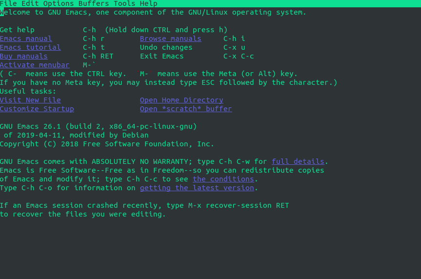
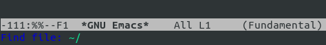

# Using Emacs in Terminal

## Why Emacs ?

Emacs is a very extensible and capable single-threaded editor, written in lisp. It is capable of doing _almost anything_. Joke going around is _Emacs is an OS that lacks a decent editor_. It is not as lightweight as vim, but is capable of much more - like playing _Tetris_. Emacs-ers are capable of doing a full day of work, without ever needing to exit emacs. From viewing mails to setting up to-dos, emacs has community provided packages for all.


## Installing Emacs

Emacs comes with GUI and Terminal version.
GUI version has more features than terminal version, but on servers, we have to use emacs on terminal.

To install Emacs: 

```
sudo apt-get update && apt-get install emacs-nox
```

To start Emacs, write:
```
emacs
```

You should now be greeted with this screen:




## File operations and navigation

Emacs keybindings are not very beginner friendly. There are starter-packs for emacs, which may have different key bindings or the user can customize the keybindings to one's liking. We are going to see default emacs keybindings.


### Keys and Notations

#### Control Key

Emacs makes extensive use of _Ctrl_ key. It is advised to shift _Left Ctrl_ to _Caps Lock_, so as to keep the pinky painless.
It is denoted as **C**.

#### Meta Key

Emacs, by default, takes _Alt_ to be the meta key. It is denoted by **M**.


#### Notation

``` C-x C-f```
This means _Ctrl_ and _x_ are pressed together and then _Ctrl_ and _f_ are again pressed. This will complete the sequence. In any circumstance, if we want to abort the sequence, press ```C-g```


### Opening file
 
One of the most basic and most important operations of any editor is opening file. 
Generally, editors use _Ctrl + O_, which opens a file-selecting dialog box.

Emacs uses:
```C-x C-f```

which reflects the changes in _minibuffer_ (The line at the bottom of screen)



Type and use _Tabs_ to autocomplete file names and paths.


## Saving file

To save file:

``` C-x C-s ```

To "Save As":

``` C-x C-w ```

it will show the prompt in _minibuffer_ to give a filename.


